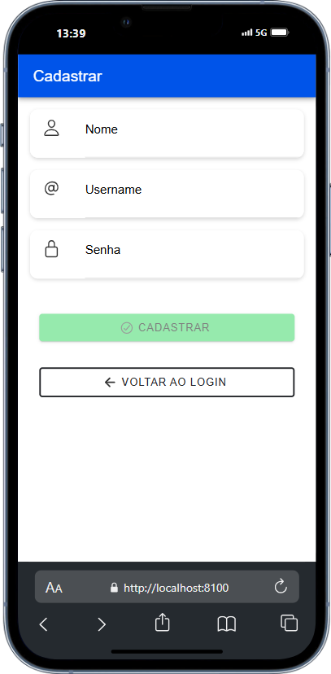

# Gerenciador de Tarefas

Este projeto é uma aplicação completa para gerenciamento de tarefas, composta por uma **API em NestJS**, um **frontend web em React** e uma **versão mobile em Ionic**. Com esta aplicação, você pode adicionar, editar, excluir e marcar tarefas como concluídas ou pendentes, além de realizar autenticação com JWT.
        
## Funcionalidades

- Adicionar, editar e excluir tarefas.
- Marcar tarefas como concluídas ou pendentes.
- Separação de tarefas concluídas e pendentes.
- Login e autenticação via JWT.

## Tecnologias Utilizadas

- **Backend/Api:** [NestJS](https://nestjs.com/)
- **Frontend Web:** [React](https://reactjs.org/)
- **Frontend Mobile:** [Ionic Framework](https://ionicframework.com/)
- **Banco de Dados:** [PostgreSQL](https://www.postgresql.org/) – utilizado para armazenar dados de tarefas, usuários e autenticação
- **Autenticação:** JWT (JSON Web Token)

## Algumas imagens do app

.png)
.png)

## Acesse o Projeto

O código-fonte completo deste projeto está disponível no GitHub. Acesse através do link abaixo:

- [Gerenciador de Tarefas no GitHub](https://github.com/JeanLima2112/To_Do_List)
